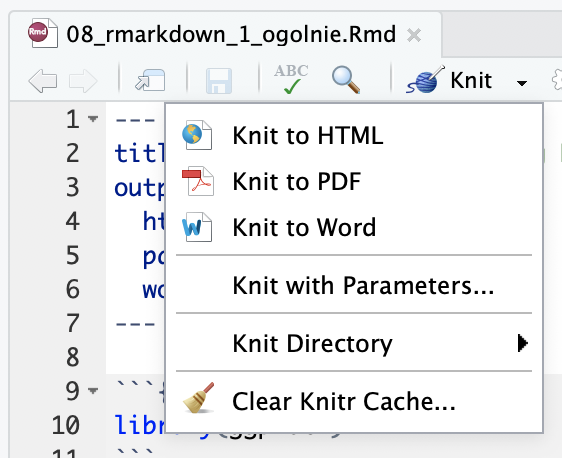

```{r echo=FALSE}
library(ggplot2) # bo w przypadku tego pliku skorzystamy z ggplota
```

Ten plik pokazuje jak można tworzyć proste dokumenty w RMarkdown. Możemy z niego wygenerować dokument klikając w mały trójkąt obok przycisku _Knit_, a następnie wybierając typ pliku, który chcemy uzyskać.


Nowy plik możemy utworzyć wybierając File -> New File -> RMarkdown.

# Nagłówek 1. poziomu robi się jednym znakiem # na początku linii
## Nagłówek 2. poziomu - dwoma
### Nagłówek 3. poziomu - trzema
###### Nagłówek 6. poziomu - szcześcioma

Linię przerwy możemy zrobić za pomocą gwiazdek jak niżej:

***

Tekst możemy napisać _kursywą_ używając jednego _podkreślnika_ lub *gwiazdki* przed i po tekście, lub __pog__**rubić** używając dwóch.

Możemy  | sobie zrobić
--------|-------
też np. | taką
tabekę  |

***

Dane obliczane w R może osadzać w tej samej linii, np. pierwiastek z 10 wynosi `r sqrt(10)`. Może też być osobnym blokiem (chunkiem) (który w RStudio 1.0 i nowszych może być wykonywany bez renderowania całego dokumentu - wystarczy kliknąć mały zielony trójkąt w prawym górnym rogu chunka):

***

```{r}
# przykładowy wykres (jest zrobiony w ggplocie, aby było można wygenerować inne rodzaje dokumentu wynikowego niż HTML)
ggplot(iris, mapping = aes(Sepal.Length, Sepal.Width, colour = factor(Species))) +
  geom_point()
```

***

A jak nie chcemy, żeby nam kod pokazywało, to na początku możemy dodać `echo=FALSE`:

```{r echo=FALSE}
ggplot(iris, mapping = aes(Sepal.Length, Sepal.Width, colour = factor(Species))) +
  geom_point()
```

***

Można także wrzucić tutaj wzory matematyczne z wykorzystaniem MathTeXa, np. $e = mc^2$ albo $c = \sqrt[2]{a^2+b^2}$. Więcej przykładów dostępne jest [tutaj](http://csrgxtu.github.io/2015/03/20/Writing-Mathematic-Fomulars-in-Markdown/) i [tutaj](https://oeis.org/wiki/List_of_LaTeX_mathematical_symbols).

***

To jest oczywiście tylko krótki pokaz. Jak ktoś chce korzystać z rmarkdown, to polecam np.

* [Dokumentację](http://rmarkdown.rstudio.com)
* [Ściągawkę](https://www.rstudio.com/wp-content/uploads/2015/02/rmarkdown-cheatsheet.pdf)
* [Rozdział w _R for data science_](https://bookdown.org/asmundhreinn/r4ds-master/r-markdown.html)
* [Krótki tutorial](http://rmarkdown.rstudio.com/articles_intro.html)
* [_Bookdown_, który pozwala nam robić całe książki](https://bookdown.org)
* ... a, i żeby nie było
    + taka lista
    + może być wielopoziomowa

