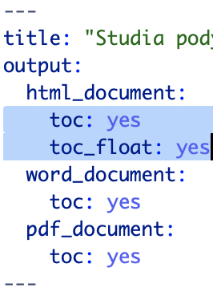

```{r echo=FALSE, message=FALSE, warning=FALSE}
# install.packages('DT')
library(DT)
library(dplyr)
library(plotly)
```

# Tabela diamonds

Tabela diamonds jest jednym z najpopularniejszcych datasetów dostępnych w pakiecie bazowym R. Więcej o nim można poczytać wpisując w konsoli ?diamonds .

# Zależność między wagą a ceną 

```{r echo = FALSE, message=FALSE, warning=FALSE}
# message=FALSE, warning=FALSE służy temu, aby wszelkie komunikaty nie były wypisywane

# tym razem wstawiamy wykres w plotly'm 
diamonds %>%
  sample_n(1000) %>% # bierzemy 1000 losowych wierszy, aby na wykresie było coś widać
  plot_ly() %>%
  add_markers(
    x = ~carat,
    y = ~price,
    color = ~color,
    text = ~paste0(
      "Przejrzystość: ", clarity,
      "\nJakość cięcia: ", cut
    )
  )
```

# Szczegółowe dane o diamentach

```{r echo = FALSE, message=FALSE, warning=FALSE}
# a tutaj wstawiamy interaktywną tabelkę korzystając z DT::datatable()
datatable(diamonds)
```

# Spis treści

Spis treści jest generowany w tym dokumencie automatycznie. Ta funkcje została włączona przez dodanie do YAMLa na początku, przy definicji dla danego typu dokumentu linii `toc: yes`. Z kolei `toc_float: yes` powoduje, że w dokumentach HTML spis treści jest osadzony na stałe po lewej stronie dokumentu, i nie jest przewijany z resztą dokumentu.


